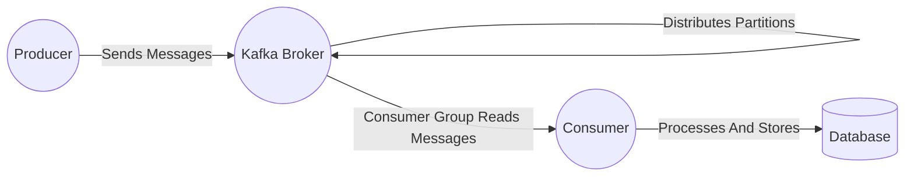

# Kafka Streaming

Node.JS Application built with TypeScript to implement Kafka Integration.

## Kafka Streaming Architecture



## Project Structure
```
📂kafka-streaming/

    📂kafka/
        connection/
            connect_to_kafka.ts
        consumer/
            kafka_c.ts
        index.ts
        package.json
        producer/
            kafka_p.ts
        topic/
            create_topic.ts
        tsconfig.json

    📂server/
        index.ts
        package.json
        router/
            routes.ts
        tsconfig.json

    .env
    .gitignore
    docker-compose.yml
    index.ts
    LICENSE
    package.json
    README.md
    tsconfig.json
```
## Getting Started

### Prerequisites

- Node.js
- Kafka
- TypeScript
- Docker (for running Kafka and Zookeeper)

### Installation

1. Clone the repository:
    ```sh
    git clone https://github.com/arkapatra31/kafka-streaming.git
    cd kafka-streaming
    ```

2. Install dependencies:
    ```sh
    npm install
    ```

3. Build the project:
    ```sh
    npm run clean-build
    ```

The application uses NPM workspaces for package management and package dependency. Here are some useful commands:

1. Create a new package:
    ```sh
    npm init -w @kafka-streaming/pkg_name
    ```

2. Install a pkg1 as a dependency in another package pkg2:
    ```sh
    npm i @kafka-streaming/pkg1 --save-dev -w @kafka-streaming/pkg2
    Add dependent pkg1 path to tsconfig reference path in pkg2 
    ```

### Running the Application

1. Start the Kafka and Zookeeper servers using Docker:
    ```sh
    docker-compose up -d
    ```

2. Start the application:
    ```sh
    npm start
    ```

3. The server will be running on port 3000.

### API Endpoints

- **Create Topic**
- **URL:** `/createTopic`
    - **Method:** `POST`
    - **Description:** Creates Kafka topic.
    - **Payload Example:**
      ```json
      {
          "topics": "Comma separated Topics"
      }

- **Publish Message**
    - **URL:** `/publish`
    - **Method:** `POST`
    - **Description:** Publishes a message to the Kafka topic.
    - **Payload Example:**
      ```json
      {
          "topic": "your-topic-name",
          "message": {
              "key": "value"
          }
      }
      ```

- **Consume Message**
    - **URL:** `/consume`
    - **Method:** `POST`
    - **Description:** Consumes messages from the Kafka topic.
    - **Payload Example:**
      ```json
      {
          "topic": "your-topic-name"
      }

## Project Details

### Kafka Connection

The Kafka connection is established in `connect_to_kafka.ts`.

### Producer

The producer logic is implemented in `kafka_p.ts`.

### Consumer

The consumer logic is implemented in `kafka_c.ts`.

### Topic Creation

The topic creation logic is implemented in `create_topic.ts`.

### Server

The server setup and routing are handled in [index.ts](http://_vscodecontentref_/1) and `routes.ts`.

## License

This project is licensed under the MIT License - see the LICENSE file for details.